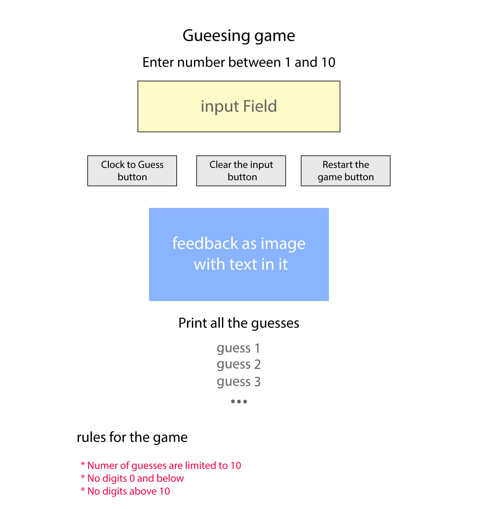

# Project 1
+ By: *Mourad Saleh*
+ Production URL: <http://p1.hes19.website>

## Project Shema

## Outside resources
I used thus resources to help myself understand the concept How to disable input conditionally and i used a different apparoach 
* https://code-examples.net/en/q/245223c

## Notes for instructor
* i would love if you could show me how to print the guesses results in one line  *

