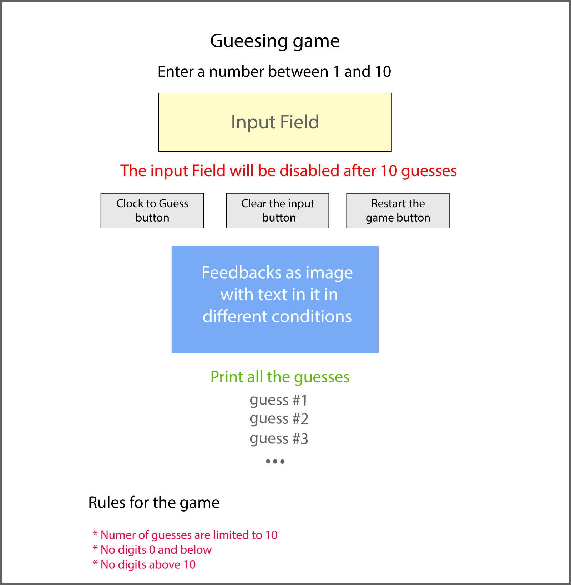

# Project 1
+ By: *Mourad Saleh*
+ Production URL: <http://p1.hes19.website>

## Project Shema

## Outside resources
*I used this resource to help myself understand the concept How to disable an input conditionally (I used a different apparoach)*

 https://code-examples.net/en/q/245223c

## Notes for instructor
*In the lecture I learnt how to print the guesses as a list, I would love if you could show me how to print the guesses results in one line please*

